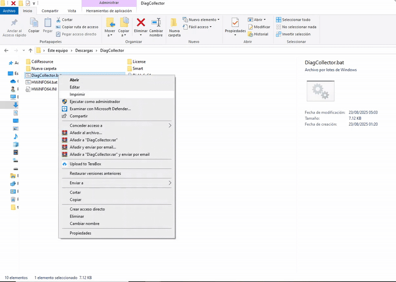
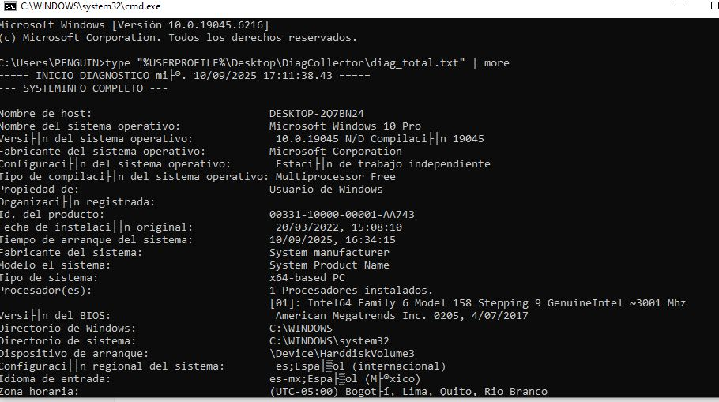
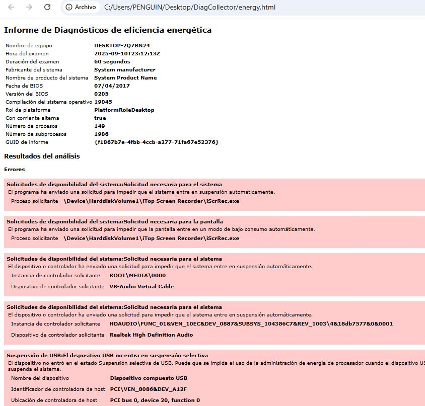

# 🛠️ Diag Collector – Herramienta de Diagnóstico Total y Soporte preventivo TI (Windows 10)

**Tipo de archivo:** Script ejecutable en **Batch (.BAT)**  
**Archivos principales del proyecto:**  
- `watch_tree.bat`  
- `DiagCollector.bat`  

---

## 📑 Descripción

**Diag Collector** es un script avanzado en **Batch (.BAT)** que automatiza la recolección completa de información de **hardware, software, red, energía y eventos del sistema** en **Windows 10**.  

Su ejecución genera un **reporte centralizado (`diag_total.txt`)** junto con reportes adicionales en formato **HTML** para un análisis técnico más claro, facilitando **soporte, auditorías y resolución de problemas**.  

> ⚠️ **Nota de privacidad**: Este repositorio será **privado** debido a la sensibilidad de los datos recolectados por los scripts.  

---

## ✨ Características principales

- 📊 **Recolección de hardware**: CPU, RAM, BIOS, placa base, GPU, discos, periféricos USB y dispositivos de entrada.  
- 🌐 **Registro de red**: configuración IP, adaptadores, WLAN, detalles de conectividad.  
- ⚙️ **Inventario de software**: programas instalados, drivers, procesos y servicios activos.  
- 👤 **Usuarios y grupos**: información de cuentas y privilegios.  
- 📅 **Eventos recientes**: registros de sistema y aplicaciones.  
- 🔋 **Reportes especializados en HTML**:  
  - `battery.html` → Informe detallado de batería.  
  - `energy.html` → Análisis de consumo energético.  
- 🔗 **Compatibilidad con herramientas externas (integración opcional)**:  
  - **CrystalDiskInfo** → Estado SMART de discos.  
  - **HWiNFO64** → Reporte avanzado de hardware.  
- 📂 **Organización automática**: todos los reportes se guardan en una carpeta única en el Escritorio (`DiagCollector`).  

---

## 🛠️ Tecnología

- **Lenguaje principal:** Windows Batch Script (`.BAT`)  
- **Herramientas nativas integradas:**  
  - `WMIC`  
  - `PowerCfg`  
  - `Netsh`  
  - `Wevtutil`  
- **Compatibilidad externa (manual):** CrystalDiskInfo · HWiNFO64  

---

## 🎥 Demo

🔗 **GIF demostrativo** mostrando la ejecución de `DiagCollector.bat` y la generación de reportes.  

  

---

## 📸 Capturas de pantalla

1. **Vista de reportes generados en la carpeta `DiagCollector`**  
     

2. **Ejemplo del archivo `battery.html` abierto en navegador**  
     

---

## 📦 Estado del Proyecto

✅ **Funcional**: Los scripts principales (`watch_tree.bat` y `DiagCollector.bat`) están listos y probados en **Windows 10**.  
🔒 **Privado**: Repositorio con acceso restringido por motivos de seguridad y privacidad de datos.  

## 📂 Releases

📦 Se publicarán versiones en la pestaña **Releases**, empaquetadas en un **archivo comprimido con contraseña**.  
🔑 **Sin la contraseña no será posible acceder al contenido.**  

El acceso al código y a los binarios queda bajo **permiso previo**.  

---

## 📬 Contacto

📧 **gabrielce992@gmail.com**  
